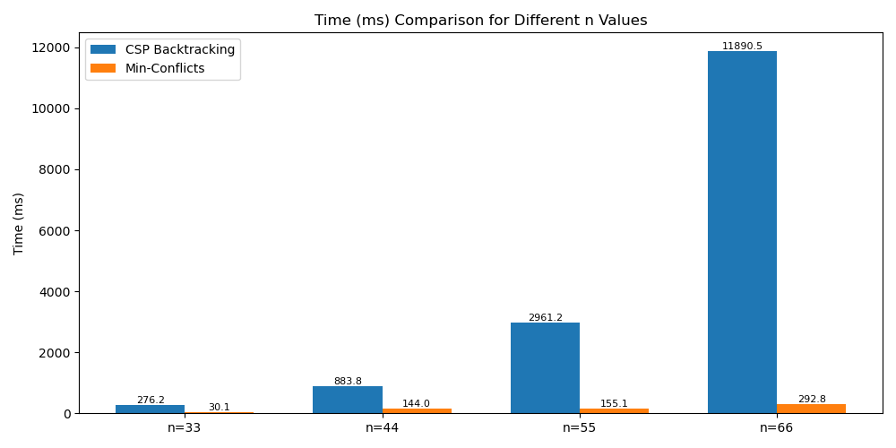

# CSP: N-Queens

**Contributors:** Namig Planov and Laman Khudadatzada

---

## Introduction

This project implements a **Constraint Satisfaction Problem (CSP)** solution for the N-Queens problem on an `n x n` chessboard. 
The goal is to place `n` queens on the board such that no two queens attack each other.

The program reads an initial board from a file or generates a random one if the file is not found. It uses iterative CSP search algorithms with heuristics and constraint propagation.

A detailed report explaining the algorithms, heuristics, and analysis of results is also included in the repository.

---

## Installation and Usage

1. Python 3.8+
2. Clone the repository:

```bash
git clone https://github.com/NamiqPlanov/P2-Team3-AI.git
cd P2-Team3-AI
```
3. Run the program:

```bash
python main.py
```
4. If no input file is found, the program will ask for `n` and generate a random board.
5. The program prints the initial board, solves the problem using either **CSP Backtracking** for `n <= 50` or **Min-Conflicts** for larger `n`.

---

## Algorithms

### CSP Backtracking (Constraint Propagation + Heuristics)

- Uses **Minimum Remaining Values (MRV)** to select the next row to assign.
- Uses **Least Constraining Value (LCV)** to order column choices.
- Applies **AC-3** algorithm for constraint propagation to reduce domains.
- Effective for smaller boards (`n <= 50`).

### Min-Conflicts (Iterative Repair)

- Randomly initializes queens on the board.
- Iteratively selects conflicted queens and moves them to minimize conflicts.
- Includes random tie-breaking for equal-conflict positions.
- Scales well for large boards (`n > 50`).

---

## Features

- Supports input from file or random generation.
- Automatically chooses the appropriate algorithm based on `n`.
- Displays solution as column indices per row and optional board visualization.
- Tracks performance: conflicts, execution time, memory usage, steps.

---

## Dependencies

- Python 3.8+
- Standard libraries: `random`, `time`, `tracemalloc`, `collections`

---

## Configuration

- Input file: `p2_n-queen.txt` (optional)
- `n`: Number of queens (10-1000)
- Maximum iterations for Min-Conflicts: 200,000 (configurable in `main.py`)

---

## Example

```
Enter n (10-1000): 8

Solving N-Queens for n = 8

Algorithm           | Heuristics                     | Conflicts   | Time(ms)   | Mem(KB)    | Solved | Steps
-----------------------------------------------------------------------------------------------
CSP Backtracking     | MRV + LCV + AC3                | 0          | 2.15       | 150.42     | Yes    | 123

Solution (column index per row):
[0, 4, 7, 5, 2, 6, 1, 3]

Board visualization:
Q . . . . . . .
. . . . Q . . .
. . . . . . . Q
. . . . . Q . .
. . Q . . . . .
. . . . . . Q .
. Q . . . . . .
. . . Q . . . .
```

For large `n`, the board visualization is skipped to avoid huge outputs.

---

## Testing

A separate test script `test.py` is provided to validate algorithms on different board sizes. It measures performance, memory, and conflicts.



---

## Report

A detailed report is included in `report.pdf` explaining:

- Problem formulation and CSP model
- Backtracking and Min-Conflicts algorithms
- Heuristics and constraint propagation
- Performance analysis and results visualization
